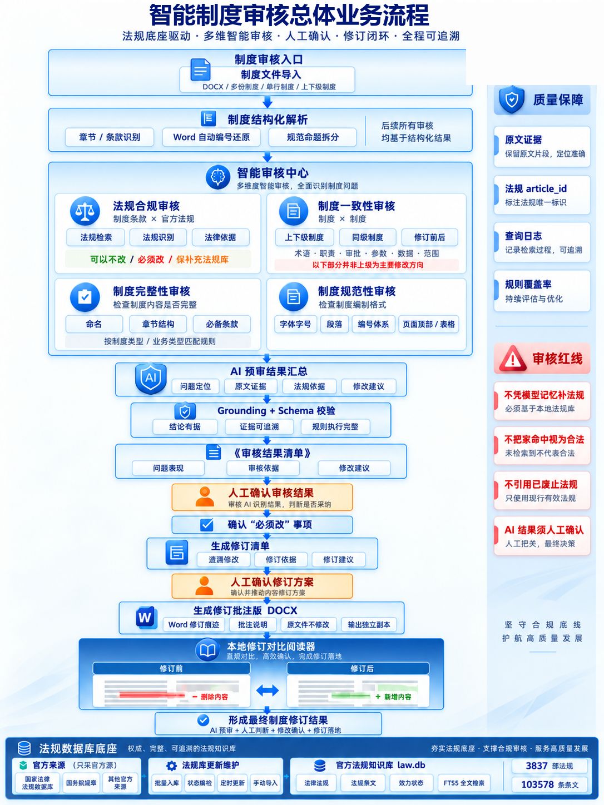
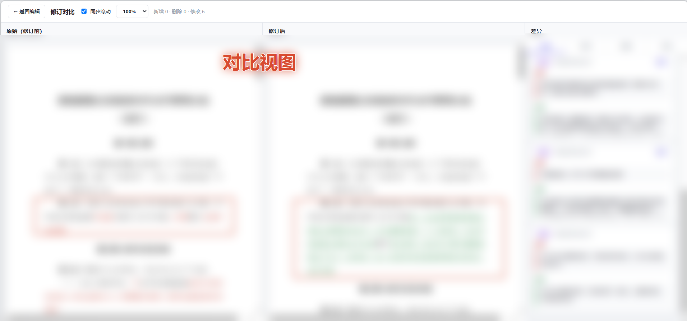

# 制度智能审核

> 客户为某通信基础设施央企，项目信息已脱敏处理。

从法规底座到审核、人工确认、修订落地的完整流程，右侧标注了四个审核红线：不凭模型记忆补法规、不把未命中视为合法、不引用已废止法规、AI 结果须人工确认。

## 项目背景

参与跨团队拆解客户审核需求，独立搭建两版 Demo。

## 我的工作

- 针对首版外部法规检索耗时、格式误报和报告难阅读的问题，建立含约 3800 部法规及历史版本与效力元数据的 SQLite FTS5 本地库。
- 设计条款拆解、正反向检索及例外核验规则。
- 开发修订对比阅读器，支持问题定位、依据展示和修订对比。

## 成果

- 同类文件符合性审核由约 11–15 分钟缩短至约 3–5 分钟。
- 客户测试 2 份制度后认可审核结果，并根据反馈优化条款编号识别与报告呈现。

## 目录

| 路径 | 内容 |
| --- | --- |
| [`assets/`](./assets) | 业务架构图等配图 |
| [`docs/法规知识库设计.md`](./docs/法规知识库设计.md) | 法规本地库的字段结构、版本与效力处理方式、检索层设计 |
| [`docs/需求拆解概览.md`](./docs/需求拆解概览.md) | 客户需求的模块化拆解结果与待确认问题类型 |
| [`law-database-preview/`](./law-database-preview) | 法规检索界面离线演示（浏览器直接打开 `index.html`） |
| [`reader-demo/`](./reader-demo) | 修订对比阅读器完整源码，含示例文档与启动脚本 |
| [`skill-pack/`](./skill-pack) | 项目核心：5 个审核技能（检索、审核、完整性、一致性、修订批注） |

## 交付物说明

### 法规检索演示

`law-database-preview/index.html` 是一个自包含的离线页面，可以按效力位阶、制定机关、效力状态筛选，按标题或条文内容检索，并查看条款原文。演示版收录 24 部示例法规，完整库为 3,837 部法规、约 10.4 万条条款。

### 修订对比阅读器

`reader-demo/` 是审核结果的阅读与操作界面，Python 后端 + 单文件前端：

- 加载带修订和批注的制度文档，通过 WPS/Word 渲染为 PDF 并在浏览器中展示
- 右侧以卡片形式展示问题描述、修订依据、修订建议，支持逐条接受/拒绝并重新渲染
- 对比视图左右分列修订前后内容，按新增/删除/修改分类，支持同步滚动与问题定位

运行方式见 [`reader-demo/README.md`](./reader-demo/README.md)。

**单文件视图**：左侧渲染制度正文并标出修订位置，右侧以卡片展示问题描述、修订依据与修订建议，点击卡片即可定位到原文对应位置。

**对比视图**：左右分列修订前后内容，右侧按「全部／新增／删除／修改」分类列出差异，支持同步滚动。

> 为保护客户信息，截图中制度正文与审核意见均已做模糊处理。

### 制度审核技能包

`skill-pack/` 是这个项目的核心，由 5 个可被智能体直接调用的技能组成，覆盖「法规检索 → 制度结构化 → 审核 → 人工确认 → 修订批注」全链路，包含文档解析、本地法规库检索、引用核验、规则基线与报告生成脚本。详见表内的独立说明：[`skill-pack/README.md`](./skill-pack/README.md)。

## 未包含的材料

以下材料涉及客户或公司内部信息，未纳入本仓库：客户需求清单原始表格（含客户原文描述、内部能力评估与工时估算）、客户制度样本文档与审核输出报告、完整法规库数据文件（约 320 MB）、客户真实组织架构、法规库访问密钥缓存。
